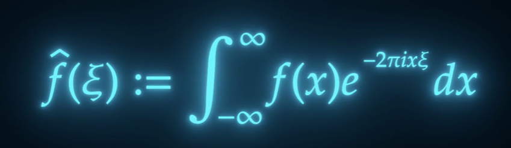

### Ch02/02_01 Numpy Overview

Let's look at one of the building blocks of the scientific Python stack, which is Numpy, sometimes pronounced Numpy. 

Numpy gives us fast **homogeneous arrays or matrices, math functions, linear algebra, randomization**. 

We can ask why do we need matrices when we have Python lists. Python lists are powerful and very fast. However, since they need to accommodate many use cases, there's a performance and memory penalty. You pay. Let's have a look. 

```
2 ** 1000
import numpy as np

np.init64(2) ** 1000

```

So here's the Python integer. And if I'm going to run this one, I'm going to get **2 to the power of 1000**, which is great, but it's going to take a lot of memory in Numpy if I'm going to take the in 64 and run this cell, I'm going to get **0** because we did what is known as an **overflow**.      

The number cannot fit in a 64 bit. Integer in scientific computation, usually a 64 or 32 bit integer or float can hold all the values you need.

Under the Hood, Numpy uses **highly optimized C and fortran code**. Don't look down at fortran. The fortran compiler can sometimes do optimizations that the C compiler can especially when dealing with the arrays.


 

Numpy offers more than speed selecting, reshaping, multiplications and more. It also provides a **lot of scientific functions**. All of these functions work both on scalars, integer floats and on arrays, so here we have Numpy sign.         

```
np.sin(27)

```
np.float64(0.956375928404503)

```

np.sin(np.array( [1,2,3] ) )
```
array([0.84147098, 0.90929743, 0.14112001])

And we compute the sine of 27 or we can run sine on an array of three elements and get the sign for every element in the array. We import Numpy as and since **Numpy has a lot of functions inside**. So instead of doing from Numpy import and then a long list, we inport Numpy, uses np and then np dot np.


# NOTES

## Overflow
```
import numpy as np

a = np.int64(2) ** 1000
print( 'a : ' + str(a) )

a.dtype
```

a : 0    
dtype('int64')     

## Power
```
result = 2 ** 3  # result will be 8 (2 raised to the power of 3)

print( result )
```
8


