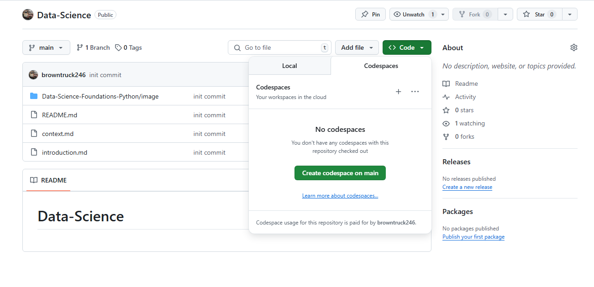

[Context](./context.md)

# INTRODUCTION

## The Python Scientific Stack

Data science is booming, and Python is a major layer. Hi, together we'll crunch some data, train some models. Create visualizations and generally have fun with Python and data. We'll solve many exercises while learning. I highly recommend that you follow along and write code. From my experience, there's some magic happening between the fingers and the brain that correctly improves the learning process. Don't be afraid to make mistakes. Python is a very forgiving language and recovering from errors. During this course, we'll cover tools and techniques that I find useful in my daily work, processing data, and gaining insights from it. I hope you'll find these tools and techniques beneficial as well. 

## What you should know
This course is about python and data science. It will help if you know a bit about both. I'm not going to teach you python if you don't know python, check out our offerings and then come back. I'm not going to teach you the basics of data science either. You can get by with a little math.

## Using GitHub Codespaces with this course
I'm going to show you how to work with GitHub Codespaces. Codespaces is a code editor in the cloud. With the full power of Visual Studio Code, it allows for real-world hands-on practice that mirrors software development in the workplace. This course was created using GitHub Codespaces. Using Codespaces you have everything you need to get going without needing complex installations or build tools. With one click you're ready to go.       

To practice, along with the course, you can create a Codespaces directly from the course overview page. First click open next to GitHub code spaces. If you're already logged in, you'll be directed to getting started with GitHub Codespaces page.  

 

```
https://docs.github.com/en/codespaces
https://mybinder.org/
```


